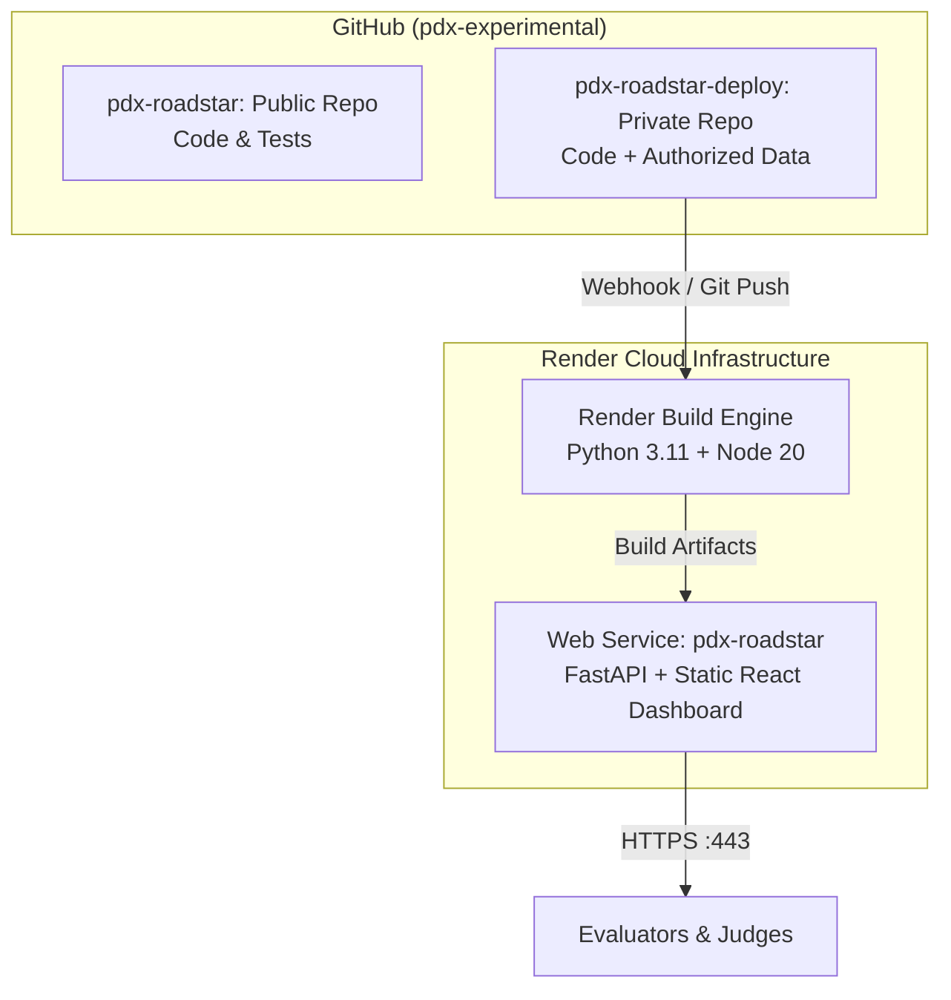

# Deployment & Cloud Architecture

This document describes the deployment architecture and hosting topology for **PDX RoadStar**, including the dual-repository strategy used to satisfy hackathon data governance and provide a live public demonstration.

---

## 1. Dual-Repository Strategy

To strictly adhere to hackathon data governance, privacy requirements, and open-source audit guidelines, PDX RoadStar uses a separated two-repository pattern:

| Repository | Visibility | Purpose | Contents |
| :--- | :--- | :--- | :--- |
| **`pdx-experimental/pdx-roadstar`** | **Public** | Code inspection, evaluation audit, reproducible testing, architecture documentation. | Clean source code (`apps/`, `packages/`, `simulator/`, `tests/`), locked dependencies (`requirements.lock`, `pnpm-lock.yaml`), test suites, acceptance scripts. **Zero organizer binary files or derived operational indices.** |
| **`pdx-experimental/pdx-roadstar-deploy`** | **Private** | CI/CD target for automated hosting on Render. | Identical application source code bundled with authorized operational scenario data (`data/Hackathon_Data.xlsx`, `data/indexed_scenarios.json`) and cloud deployment manifests (`render.yaml`, `Dockerfile`, `build.sh`, `start.sh`). |

### Why Segregate Deployment?
1. **Zero Organizer Data Leakage**: The organizer-provided workbook contains proprietary route and driver operational identifiers. The public repository remains completely free of these files.
2. **Turnkey Live Demonstration**: Evaluators can instantly interact with the full-fleet multi-day simulation at the live URL without having to configure local Python virtual environments or download external workbooks.
3. **Reproducibility**: The public repository provides exact `--require-hashes` lockfiles, allowing any evaluator with authorized access to the original workbook to reproduce all tests locally.

---

## 2. Render Cloud Deployment Topology

The application is deployed on **Render** as a full-stack containerized / native web service.



### Build & Runtime Pipeline
1. **Frontend Build**: Vite compiles React 19 dashboard into static assets (`apps/web/dist/`).
2. **Backend Engine**: FastAPI serves both REST simulation endpoints and mounts `apps/web/dist/` at `/`.
3. **Domain Adapters**: Publishes detention claims and execution plans using public `prodocux==0.3.0rc4` and `pdx-artifact-engine==0.3.0a5`.
4. **Port Binding**: Automatically reads `$PORT` injected by Render (defaults to `8000` locally).

---

## 3. Render Service Specification (`render.yaml`)

```yaml
services:
  - type: web
    name: pdx-roadstar
    runtime: python
    plan: standard
    region: oregon
    buildCommand: bash build.sh
    startCommand: bash start.sh
    healthCheckPath: /health
    envVars:
      - key: PYTHON_VERSION
        value: 3.11.9
      - key: NODE_VERSION
        value: 20.18.0
      - key: ROADSTAR_DATASET_PATH
        value: data/Hackathon_Data.xlsx
      - key: ROADSTAR_SCENARIO_INDEX_PATH
        value: data/indexed_scenarios.json
      - key: ROADSTAR_PUBLIC_DEMO
        value: "true"
```

---

## 4. Local Execution for Authorized Evaluators

Authorized evaluators holding the original competition dataset can run the application locally:

```powershell
# 1. Setup Python virtual environment
python -m venv .venv
.\.venv\Scripts\python.exe -m pip install --require-hashes -r requirements.lock

# 2. Build Frontend
pnpm --dir apps/web install --frozen-lockfile
pnpm --dir apps/web build

# 3. Configure Dataset Paths
$env:ROADSTAR_DATASET_PATH = "D:\authorized\Hackathon_Data.xlsx"
$env:ROADSTAR_SCENARIO_INDEX_PATH = "D:\authorized\indexed_scenarios.json"

# 4. Verify & Run
.\.venv\Scripts\python.exe -m pytest tests -q
.\.venv\Scripts\python.exe apps/api/main.py
```
Open `http://localhost:8000/` in any browser.
